# Aufbau und Funktionsweise einer Minecraft-ALU

![[bilder/alu.png]]

Eine **Arithmetic Logic Unit (ALU)** ist ein zentraler Bestandteil von Prozessoren (CPUs). Sie übernimmt arithmetische und logische Berechnungen, die für die Ausführung von Programmen notwendig sind. In Minecraft habe ich eine 8-Bit ALU nachgebaut, die verschiedene Operationen unterstützt, darunter Addition, Subtraktion, Inkrementierung, Dekrementierung und Logikoperationen. Im Folgenden erläutere ich den Aufbau und die Funktionsweise der ALU und erkläre die Logik hinter den einzelnen Komponenten anhand der Minecraft-Konstruktion. Alle technischen Details werden durch Bilder und Diagramme unterstützt.

---

## **1. Überblick über die ALU**

![[bilder/Pasted image 20250127195824.png]]

Die ALU ist in mehrere Module unterteilt, die jeweils bestimmte Funktionen übernehmen. Jedes Modul basiert auf logischen Schaltungen, die mit Minecraft-Redstone und Schaltern umgesetzt wurden. 

### **Funktionsprinzip**
- **Arithmetische Operationen**: Addition, Subtraktion, Inkrementierung und Dekrementierung werden mit Addierern und Subtrahierern durchgeführt.
- **Logikoperationen**: Verschiedene logische Gatter wie AND, OR, XOR und NOT ermöglichen logische Berechnungen.
- **Steuerung über Opcode**: Die ALU verwendet ein 2-Bit-Steuersignal (Opcode), um die gewünschte Operation auszuwählen.

Ein schematischer Überblick über die Logik der ALU:  
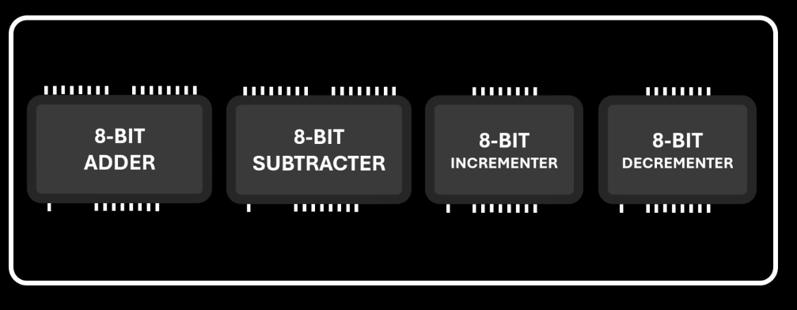  

Das Layout der gesamten ALU als Schaltplan:  
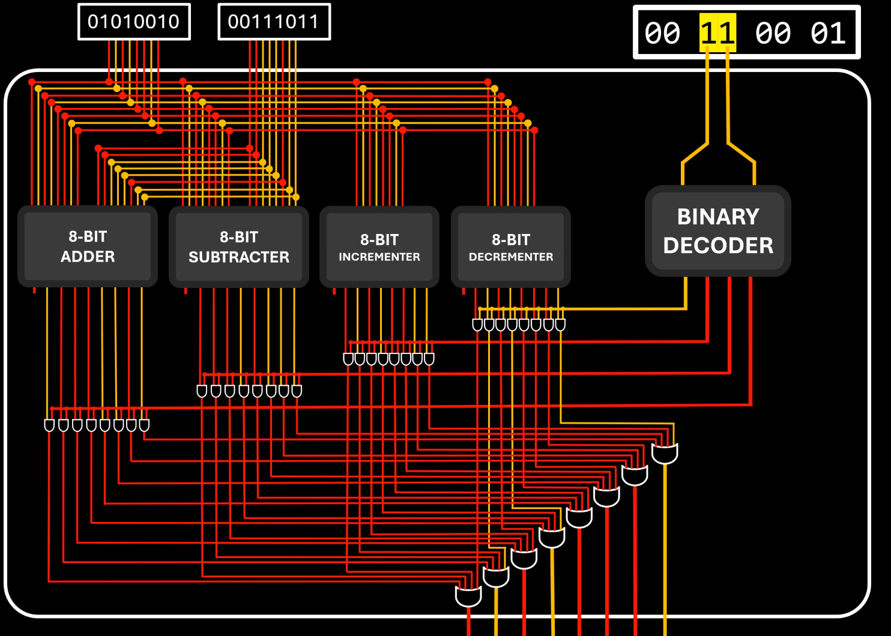  

---

## **2. Komponenten der ALU**

Die ALU besteht aus mehreren Hauptkomponenten, die im Folgenden einzeln erläutert werden. Jede Komponente wurde in Minecraft basierend auf ihrer logischen Struktur realisiert.

---

### **2.1 Der 8-Bit Adder**

Der **Adder** ist eines der zentralen Module der ALU. Er dient dazu, zwei 8-Bit-Zahlen zu addieren. Dabei wird das Ergebnis sowie ein Übertragsbit (Carry-Out) ausgegeben, falls die Addition überläuft.

- **Minecraft-Nachbau des Adders**  
  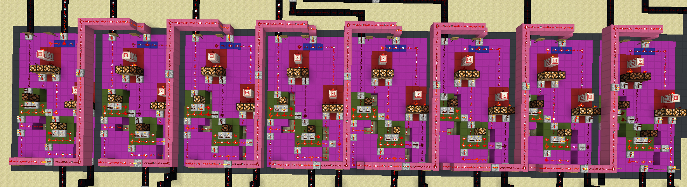  

- **Schematische Darstellung der Verbindungen**  
  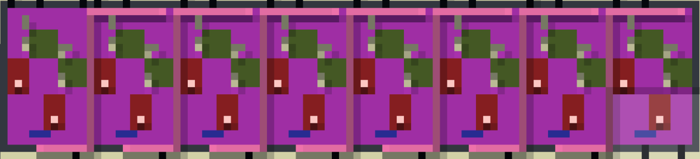  

- **Logik des Adders als vereinfachter Schaltplan**  
  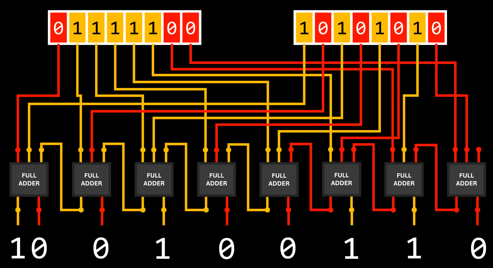  

Ein 8-Bit Adder besteht aus 8 **Full Adders**, die in einer Kette verbunden sind. Jeder Full Adder übernimmt die Addition eines Bit-Paares der Eingabewerte sowie eines Carry-In-Bits.

#### **2.1.1 Der Full Adder als einzelne Komponente**

Ein einzelner Full Adder basiert auf grundlegenden Logikgattern:
- **AND-Gatter**: Zum Berechnen des Übertrags.
- **XOR-Gatter**: Für die eigentliche Addition.
- **OR-Gatter**: Um den endgültigen Übertrag zu bestimmen.

Die Logik eines Full Adders ist im folgenden Diagramm dargestellt:  
![[bilder/full-adder-design.png]]

In Minecraft umgesetzt sieht der Full Adder wie folgt aus:  
- Physischer Aufbau:  
  ![[bilder/full-adder.png]]  
- Schematische Ansicht:  
  ![[bilder/full-adder-scem.png]]  

---

### **2.2 Der 8-Bit Subtractor**

Der **Subtractor** ist für die Subtraktion zweier 8-Bit-Zahlen verantwortlich. Anstelle eines Übertragsbits (Carry-Out) arbeitet er mit einem **Borrow-Bit**, das angibt, ob beim Subtrahieren ein "Ausleihen" notwendig war.

- **Minecraft-Nachbau des Subtractors**  
  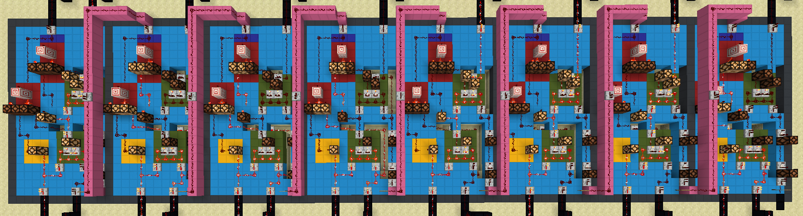  

- **Logik des Subtractors**  
  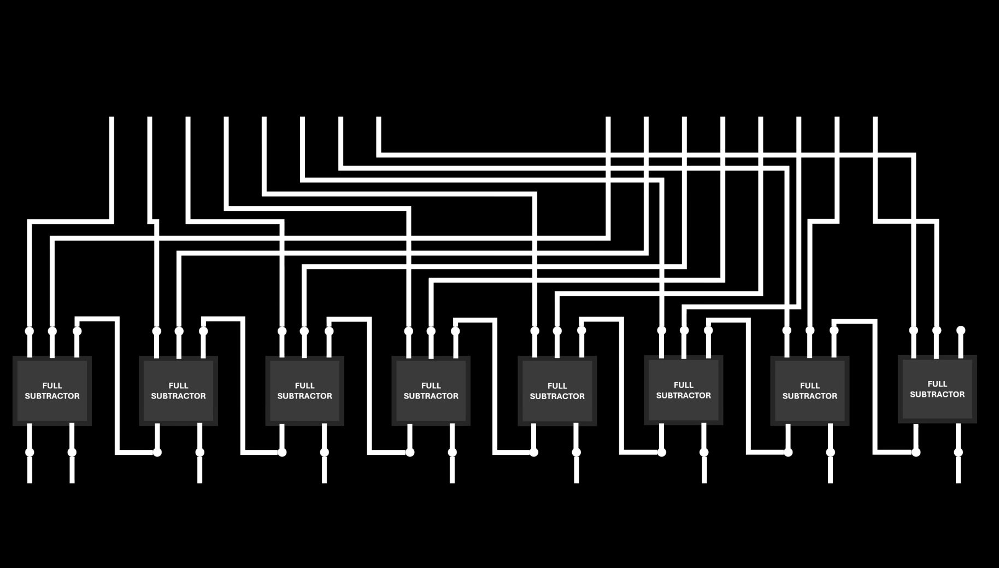  

- **Schematische Übersicht der Verbindungen**  
  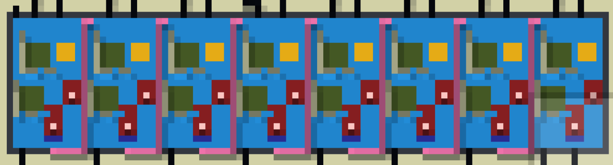  

Wie der Adder besteht der Subtractor aus 8 **Full Subtractors**, die in einer Kette miteinander verbunden sind. 

#### **2.2.1 Der Full Subtractor als einzelne Komponente**

Ein Full Subtractor ähnelt in seiner Struktur dem Full Adder, enthält jedoch zusätzliche **NOT-Gatter**, um die Negation eines Bits zu ermöglichen. 

- Logikdiagramm des Full Subtractors:  
  ![[bilder/full-subtractor-design.png]]

- Minecraft-Nachbau:  
  - Physischer Aufbau:  
    ![[bilder/full-subtractor.png]]  
  - Schematische Ansicht:  
    ![[bilder/full-subtractor-scem.png]]  

---

### **2.3 Der 8-Bit Incrementer und Decrementer**

Der **Incrementer** erhöht den Wert einer 8-Bit-Zahl um 1, während der **Decrementer** ihn um 1 verringert. Beide Module nutzen vereinfachte Addier- und Subtrahierlogik.

#### **Incrementer**
- Physischer Aufbau:  
  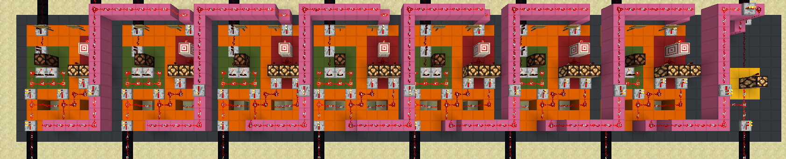  
- Schematische Ansicht:  
  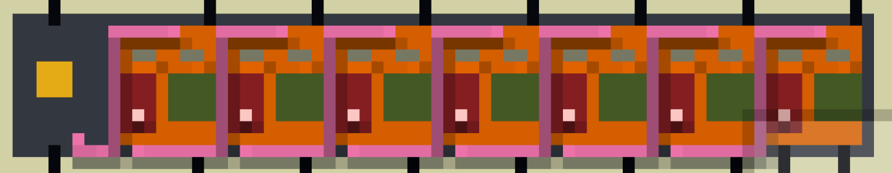  

#### **Decrementer**
- Physischer Aufbau:  
  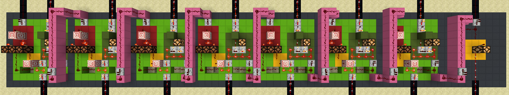  
- Schematische Ansicht:  
  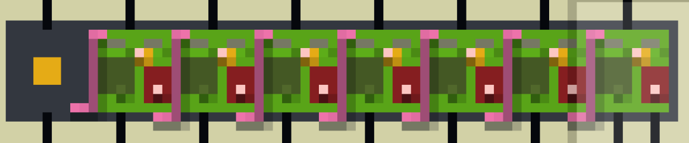  

Der Aufbau basiert auf den sogenannten **Half Adders** und **Half Subtractors**, die jeweils nur zwei Inputs verarbeiten können.

#### **2.3.1 Half Adder und Half Subtractor**

- **Half Adder**
  - Logikdiagramm:  
    ![[bilder/half-adder-design.png]]  
  - Minecraft-Umsetzung:  
    ![[bilder/half-adder.png]]  
    ![[bilder/half-adder-scem.png]]  

- **Half Subtractor**
  - Logikdiagramm:  
    ![[bilder/Pasted image 20250127202403.png]]  
  - Minecraft-Umsetzung:  
    ![[bilder/half-subtractor.png]]  
    ![[bilder/half-subtractor-scem.png]]  

---

## **3. Logikbausteine der ALU**

### **3.1 Der 2-Bit Decoder**

Der Decoder wandelt eine 2-Bit-Eingabe in eine spezifische Ausgabe um, bei der nur ein Ausgang aktiviert wird. Dies ist entscheidend für die Auswahl der einzelnen ALU-Operationen.

- Minecraft-Nachbau:  
  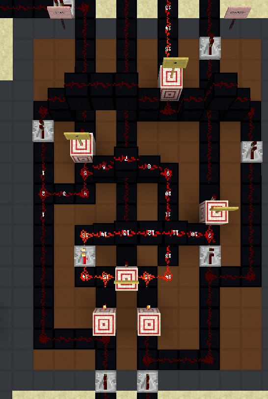  
- Schematische Darstellung:  
  ![[bilder/binary-decoder-design 1.png]]  

---

### **3.2 Logikgatter**

Logikgatter sind die grundlegenden Bausteine der ALU. Sie ermöglichen Operationen wie:
- **AND**: Liefert nur TRUE, wenn beide Eingänge TRUE sind.
- **OR**: Liefert TRUE, wenn mindestens ein Eingang TRUE ist.
- **NOT**: Negiert den Eingang.
- **XOR**: Liefert TRUE, wenn genau ein Eingang TRUE ist.

- Schaltplan der Logikgatter:  
  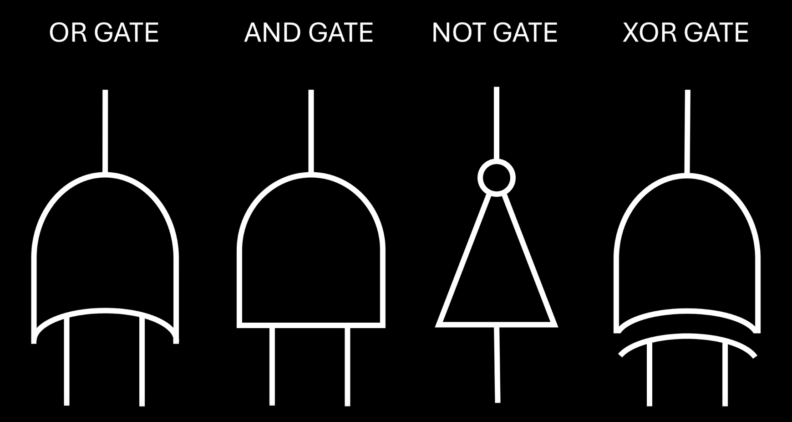  

---

## **4. Steuerung über Opcode**

Die ALU wird mithilfe eines 2-Bit-Opcodes gesteuert, der bestimmt, welche Operation ausgeführt werden soll.

- **Erstes Bit (Linke Operation)**  
  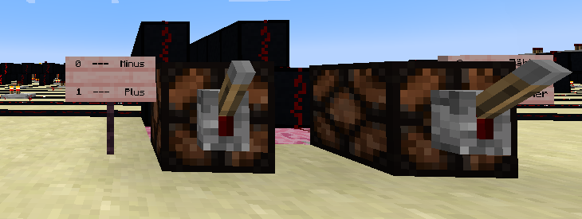  
- **Zweites Bit (Rechte Operation)**  
  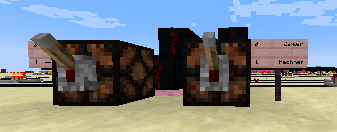  

Die Kombination der Opcodes aktiviert bestimmte Module der ALU über UND-Gatter:  
- Aufbau:  
  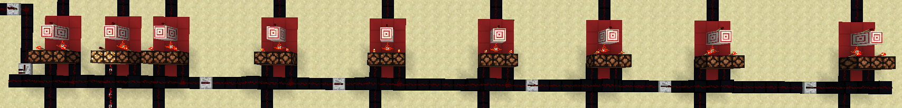  
- Schema:  
  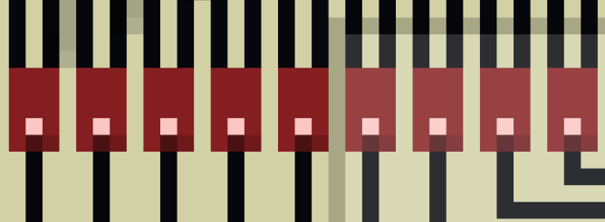  

---

## **5. Gesamtübersicht**

Zum Abschluss ein Überblick über die gesamte ALU:  
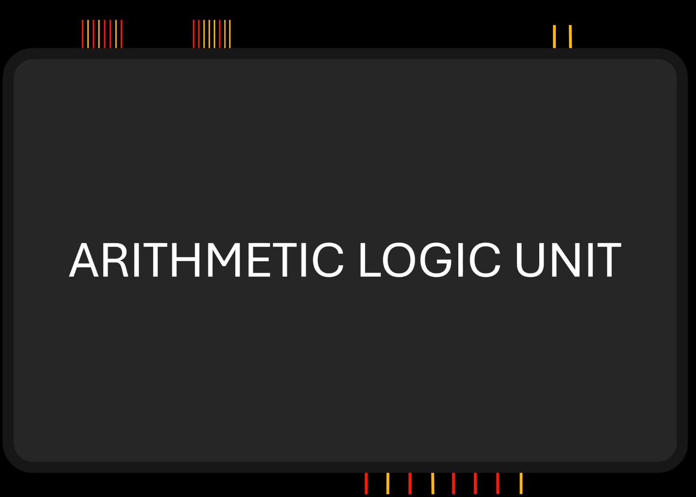  

Die Umsetzung in Minecraft zeigt, dass auch komplexe Rechenoperationen mit Redstone möglich sind. Jede Komponente basiert auf den Grundlagen der Digitaltechnik und wurde entsprechend umgesetzt.

