# Aufbau und Funktionsweise einer Minecraft-ALU

Eine **Arithmetic Logic Unit (ALU)** ist ein zentraler Bestandteil von CPUs, die arithmetische und logische Operationen durchführt. In Minecraft habe ich eine 8-Bit ALU nachgebaut, die mehrere grundlegende Operationen unterstützt, darunter Addition, Subtraktion, Inkrementierung, Dekrementierung und Logikoperationen. Hier erkläre ich den Aufbau, die Funktionsweise und stelle die Logik hinter den Komponenten vor – unterstützt durch die Bilder meiner Konstruktion.

---

## **1. Überblick über die ALU**

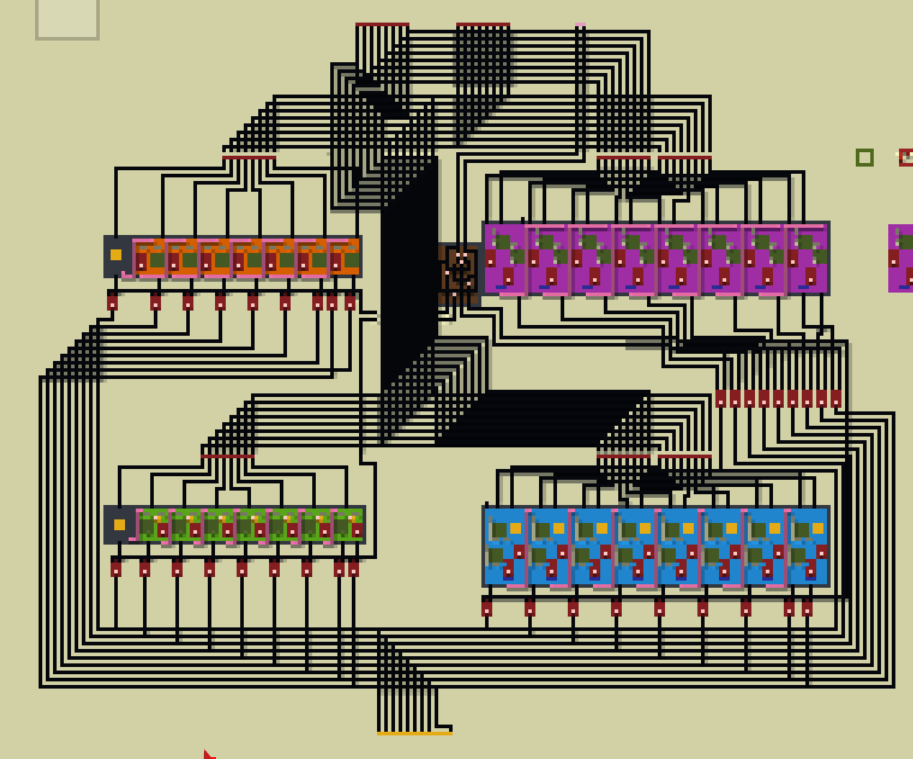

Die ALU in Minecraft setzt sich aus mehreren logischen und arithmetischen Modulen zusammen. 

Die Logik hinter der ALU:  
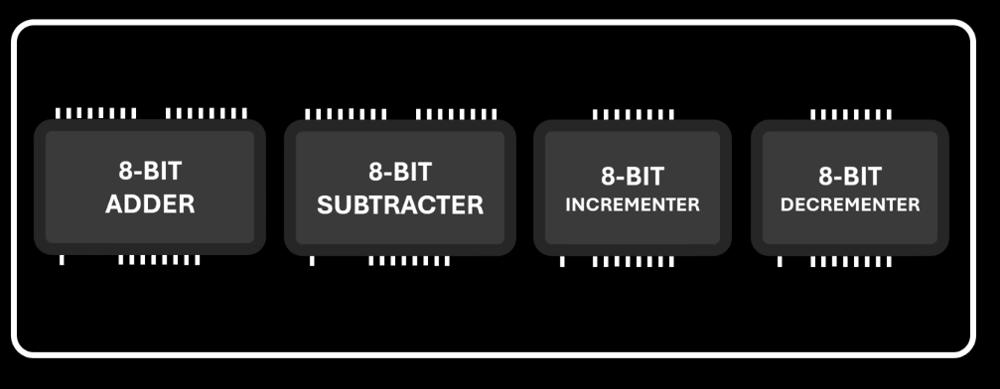  

Das gesamte ALU-Layout als Schaltplan im Überblick:  
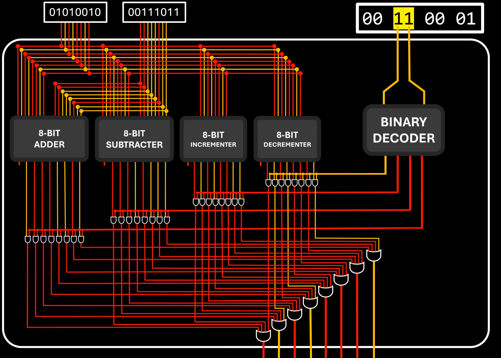  

---

## **2. Komponenten der ALU**

Schauen wir uns jetzt die einzelnen Komponenten genauer an. Fangen wir mit dem 8-Bit Adder an.

### **2.1 Der 8-Bit Adder**
Der **Adder** ist eines der zentralen Elemente der ALU. Er addiert zwei 8-Bit-Zahlen und gibt das Ergebnis sowie ein Übertragsbit (Carry-Out) aus.  

Minecraft-Nachbau des Adders:  
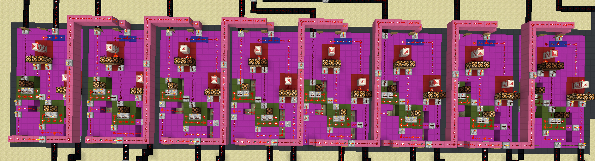  

Die schematische Darstellung zeigt, wie die Module miteinander verbunden sind:  
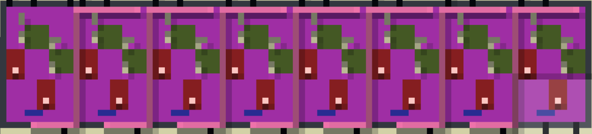  

Die Logik des Adders in einem vereinfachten Schaltplan:  
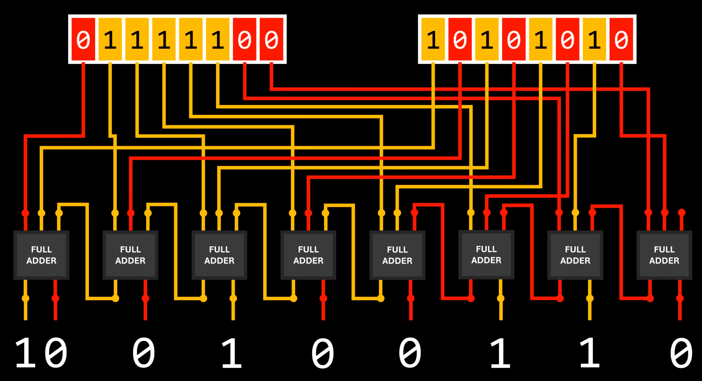  

Ein 8-Bit Adder besteht aus 8 Full Addern. Ein einzelner Full Adder sieht wie folgt aus:

#### 2.1.1 Der Full Adder als einzelne Komponente

Ein einzelner Full Adder ist im folgendem Diagramm, mithilfe von Logikgattern, dargestellt:  
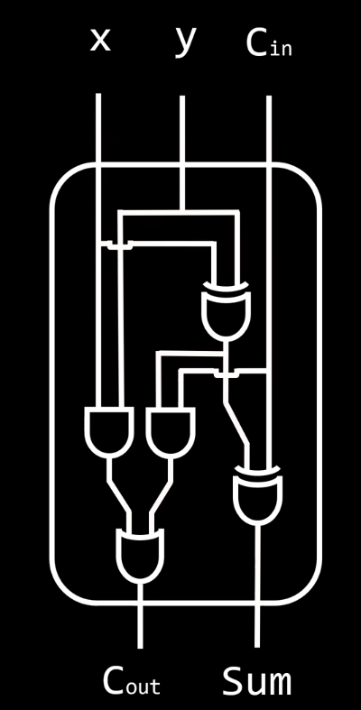

In Minecraft sieht es folgendermaßen aus:  

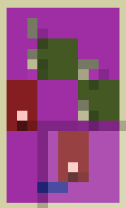  
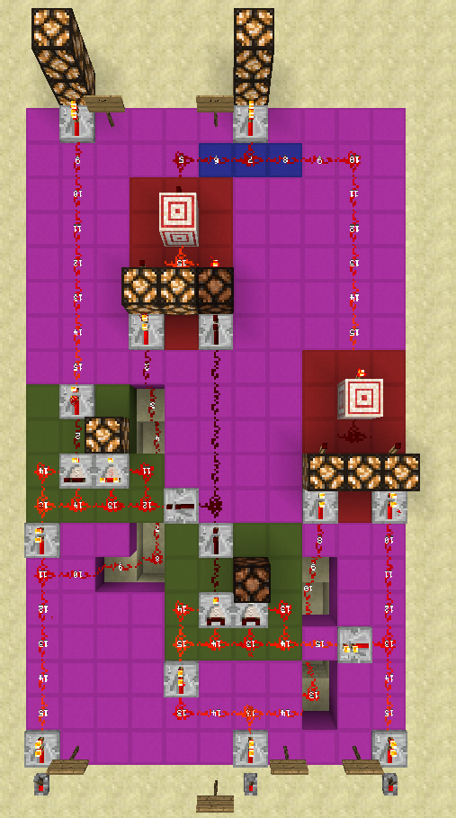

---

### **2.2 Der 8-Bit Subtractor**
Der **Subtractor** ist dafür verantwortlich, eine 8-Bit-Zahl von einer anderen zu subtrahieren. Er arbeitet ähnlich wie der Adder, verwendet jedoch ein Borrow-Bit statt eines Carry-Outs.  

Minecraft-Nachbau des Subtractors:  
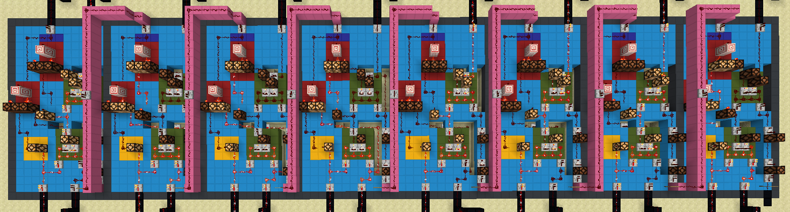  

Eine Darstellung der Logik des Subtractors:  
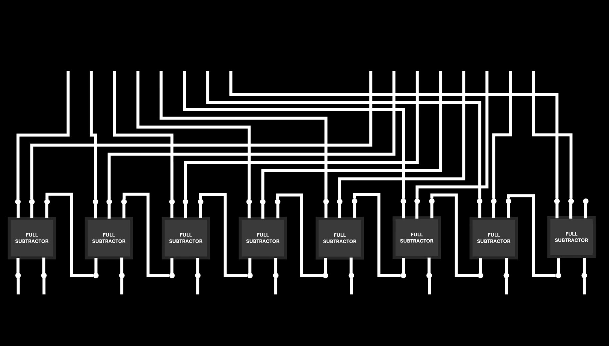  

Die schematische Übersicht der Verbindungen:  
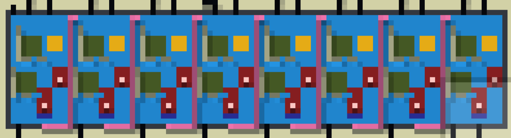  

Ein 8-Bit Subtractor besteht aus 8 Full Subtrators. Ein einzelner Full Subtractor sieht wie folgt aus:

#### 2.2.1 Der Full Subtractor als einzelne Komponente

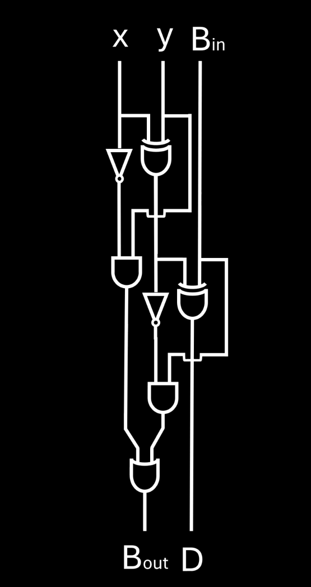

Er besteht, wie auch der Full Adder, aus zwei AND-Gates, zwei XOR-Gates und einem OR-Gate. Jedoch kommen hier noch zwei NOT-Gates hinzu.  
In Minecraft sieht es folgendermaßen aus:  

  
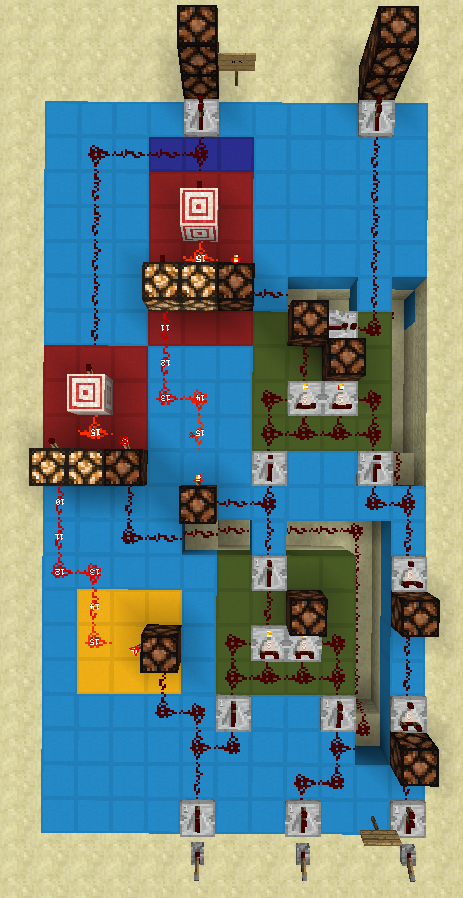

---

### **2.3 Der 8-Bit Incrementer und Decrementer**
Der **Incrementer** erhöht den Wert einer 8-Bit-Zahl um 1, während der **Decrementer** ihn um 1 verringert.  

- **Incrementer**  
  Physischer Aufbau:  
  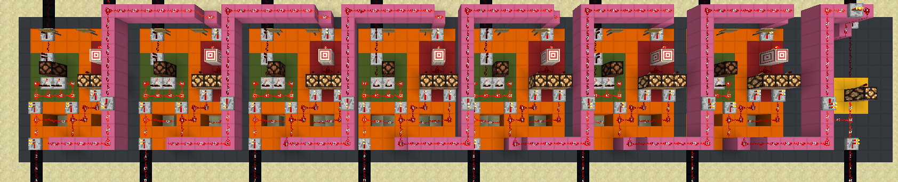  
  Schema:  
  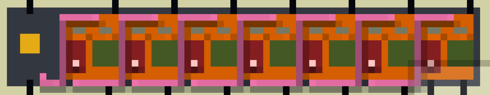  

- **Decrementer**  
  Physischer Aufbau:  
  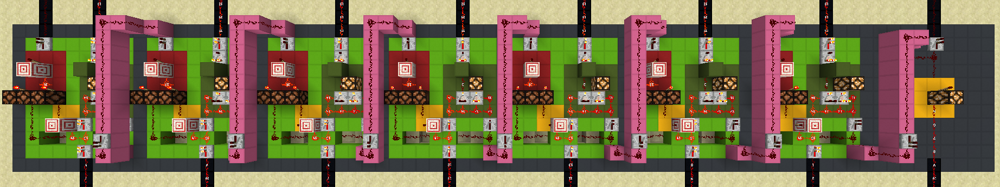  
  Schema:  
  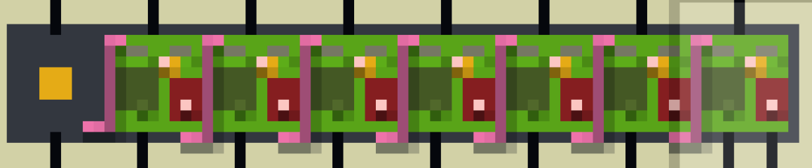  

Der Incrementer und Decrementer verwenden sieben Half Adder bzw. Half Subtractor und ein NOT-Gate.

#### 2.3.1 Half Adder und Half Subtractor

Der Aufbau für den Half Adder ist folgender:  
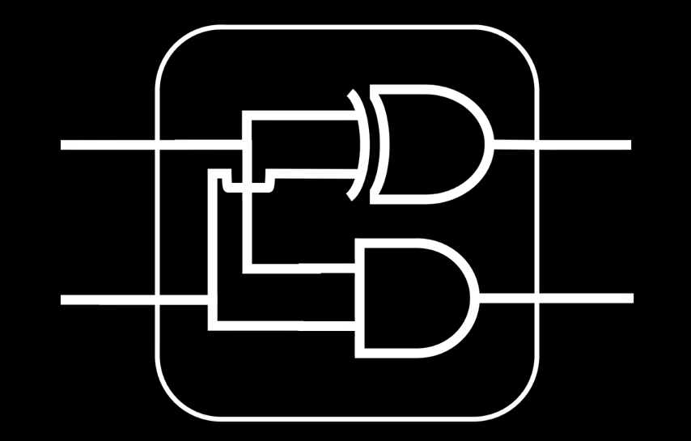

In Minecraft umgesetzt sieht es folgendermaßen aus:  
  
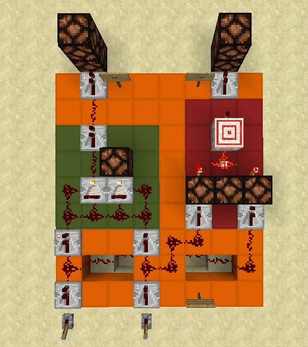

Der Half Subtractor hat zusätzlich ein NOT-Gate:  
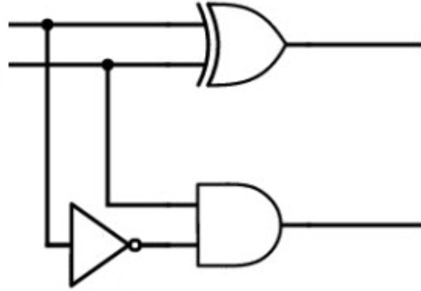

In Minecraft umgesetzt sieht es folgendermaßen aus:  
  
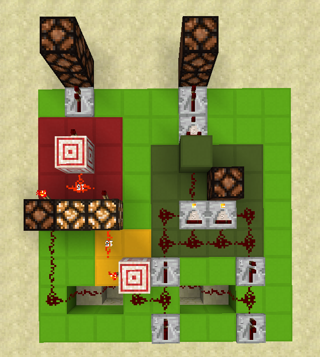

---

## **3. Logikbausteine der ALU**

### **3.1 Der 2-Bit Decoder**
Der **Decoder** wandelt eine 2-Bit-Eingabe in eine spezifische Ausgabe um, die nur einen einzigen Ausgang aktiviert.  

Minecraft-Nachbau des Decoders:  
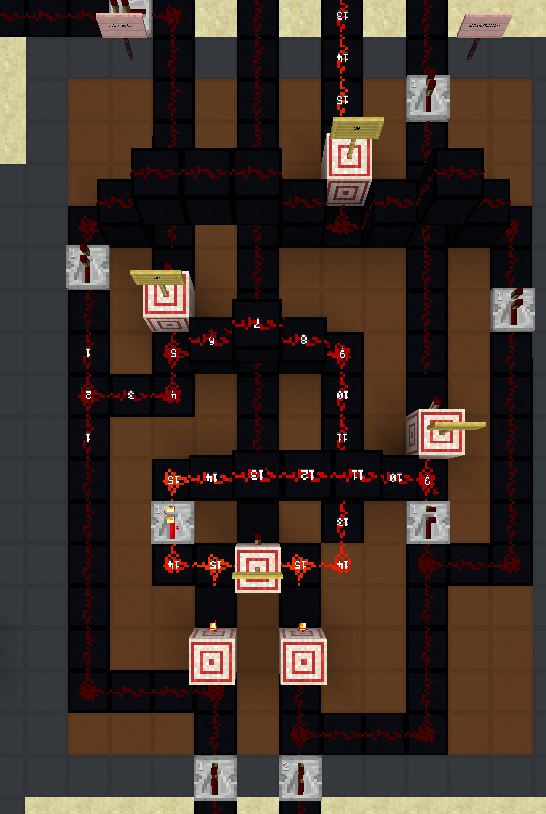  

Schematische Darstellung:  

---

### **3.2 Logikgatter**
Logikgatter bilden die Grundlage jeder ALU. Sie werden verwendet, um AND-, OR-, NOT- und XOR-Operationen durchzuführen.  

Die wichtigsten Logikgatter als Schaltplan:  
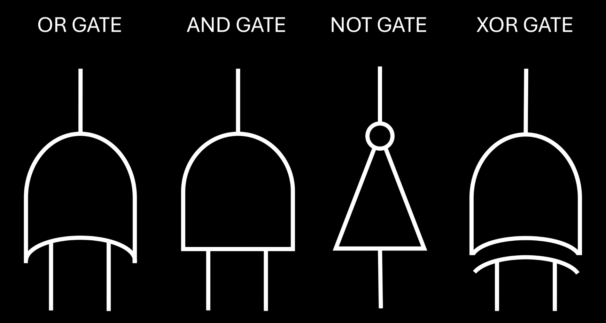

---

## **5. Gesamtübersicht**

Abschließend gibt es hier eine schematische Deckblatt-Ansicht der gesamten ALU:  
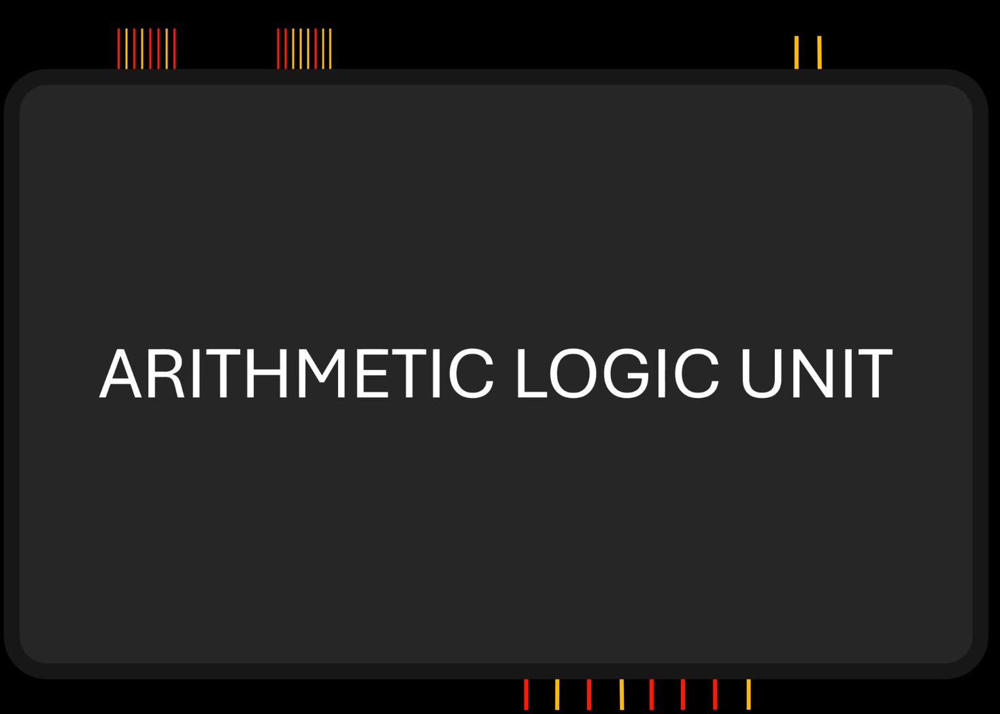

Zusätzlich wurde die Eingabe eines 2-Bit-Opcodes umgesetzt, mit dem bestimmt wird, welche Recheneinheit aktiv ist:  

- Erstes Bit:  
  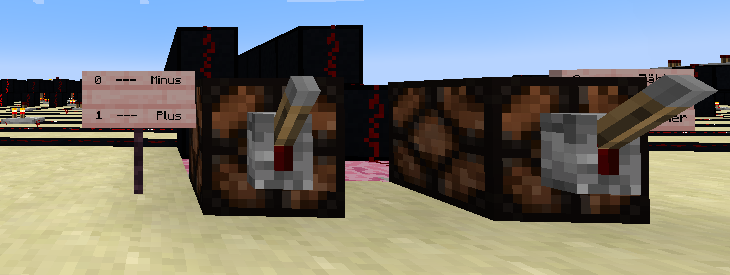  
- Zweites Bit:  
  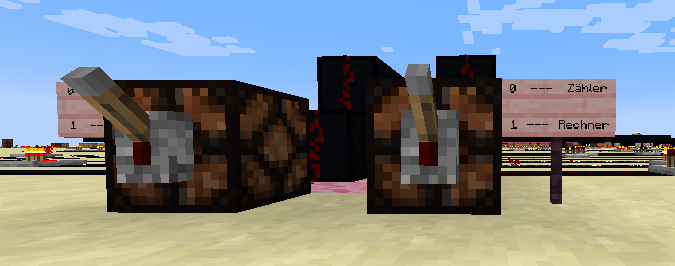  

Die AND-Gates, die die Einheiten aktivieren:  
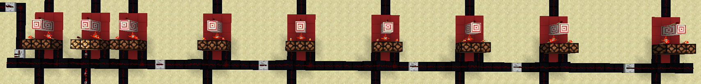  
Schema dazu:  
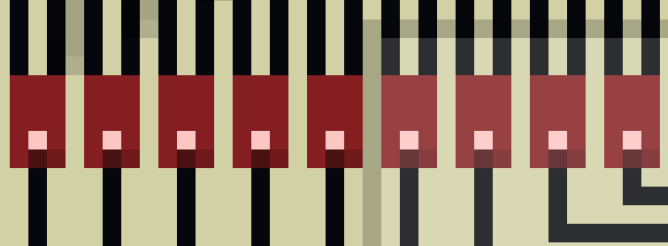

