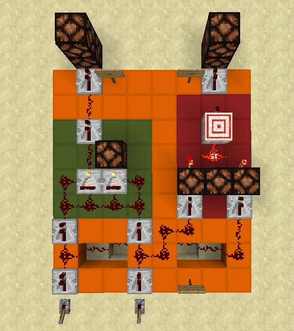
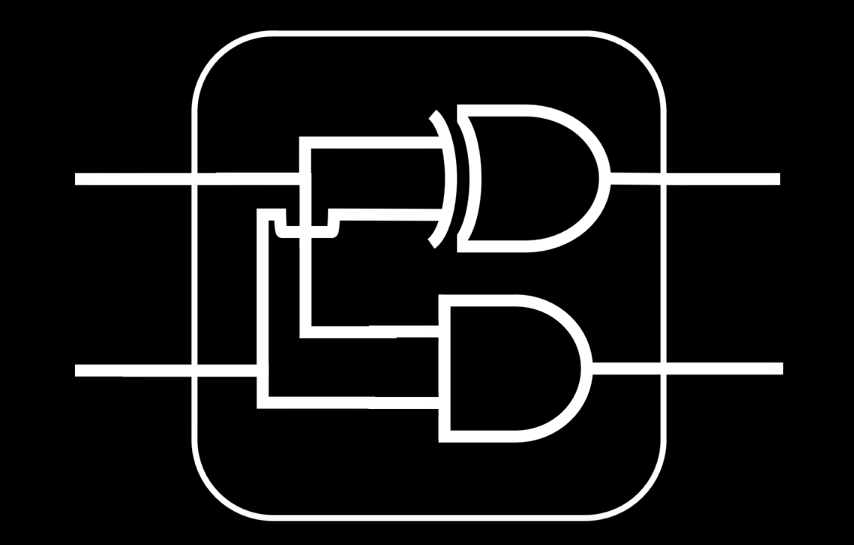
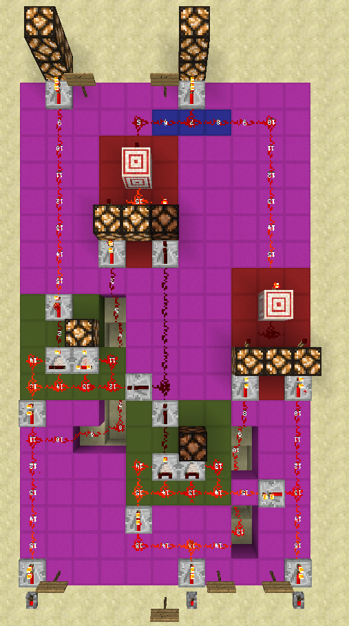
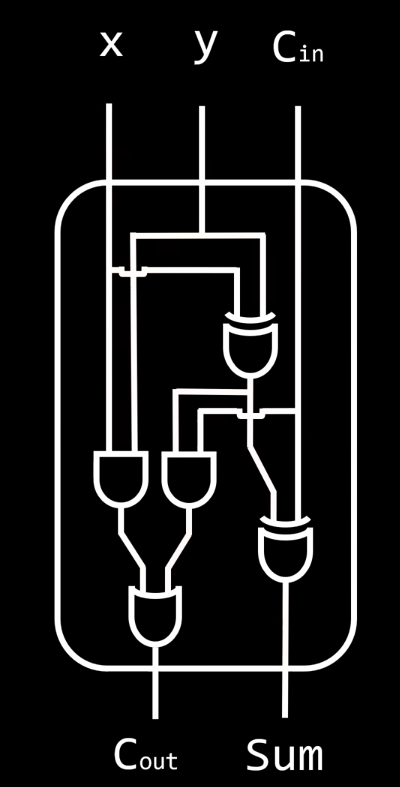
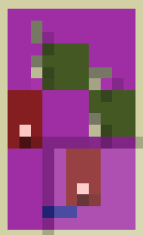
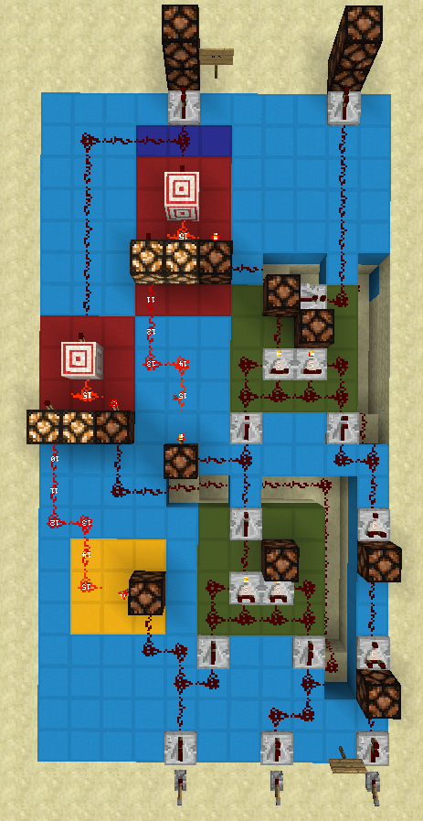
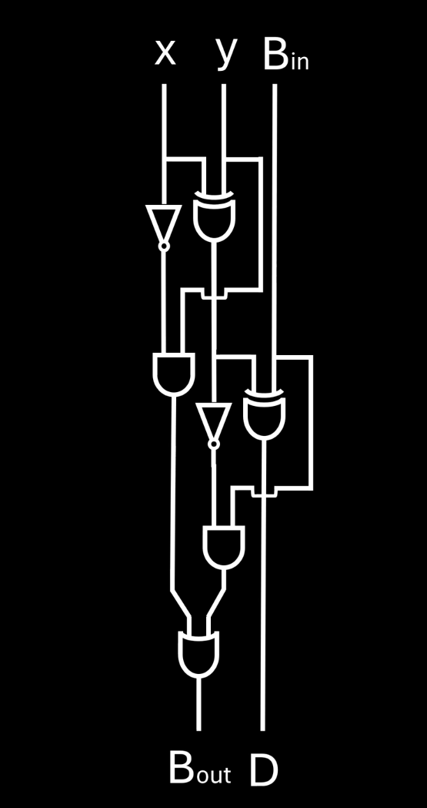

# Aufbau und Funktionsweise einer Minecraft-ALU

![[bilder/alu.png]]

Eine **Arithmetic Logic Unit (ALU)** ist ein zentraler Bestandteil von CPUs, die arithmetische und logische Operationen durchführt. In Minecraft habe ich eine 8-Bit ALU nachgebaut, die mehrere grundlegende Operationen unterstützt, darunter Addition, Subtraktion, Inkrementierung, Dekrementierung und Logikoperationen. Hier erkläre ich den Aufbau, die Funktionsweise und stelle die Logik hinter den Komponenten vor – unterstützt durch die Bilder meiner Konstruktion.

---

## **1. Überblick über die ALU**

![[bilder/Pasted image 20250127195824.png]]

Die ALU in Minecraft setzt sich aus mehreren logischen und arithmetischen Modulen zusammen. 

Die Logik hinter der ALU:  
  

Das gesamte ALU-Layout als Schaltplan im Überblick:  
  

---

## **2. Komponenten der ALU**

Schauen wir uns jetzt die einzelnen Komponenten genauer an. Fangen wir mit dem 8-Bit Adder an.

### **2.1 Der 8-Bit Adder**
Der **Adder** ist eines der zentralen Elemente der ALU. Er addiert zwei 8-Bit-Zahlen und gibt das Ergebnis sowie ein Übertragsbit (Carry-Out) aus.  

Minecraft-Nachbau des Adders:  
  

Die schematische Darstellung zeigt, wie die Module miteinander verbunden sind:  
  

Die Logik des Adders in einem vereinfachten Schaltplan:  
  

Anhand des oberen Bildes sehen wir, dass ein 8-Bit Adder aus 8 Full Addern besteht. Ein einzelner Full Adder sieht wie folgt aus:
#### 2.1.1 Der Full Adder als einzelne Komponente

Ein einzelner Full Adder ist im folgendem Diagramm, mithilfe von Logikgattern, dargestellt:
![[bilder/full-adder-design.png]]

Er besteht aus zwei and-gates, zwei xor-gates und einem or-gate.
In Minecraft sieht es folgendermaßen aus:

![[bilder/full-adder-scem.png]] ![[bilder/full-adder.png]]

---

### **2.2 Der 8-Bit Subtractor**
Der **Subtractor** ist dafür verantwortlich, eine 8-Bit-Zahl von einer anderen zu subtrahieren. Er arbeitet ähnlich wie der Adder, verwendet jedoch ein Borrow-Bit statt eines Carry-Outs.  

Minecraft-Nachbau des Subtractors:  
  

Eine Darstellung der Logik des Subtractors:  
  

Die schematische Übersicht der Verbindungen:  
  

Anhand des oberen Bildes sehen wir, dass ein 8-Bit Subtractor aus 8 Full Subtrators besteht. Ein einzelner Full Subtractor sieht wie folgt aus:
#### 2.2.1 Der Full Subtractor als einzelne Komponente

![[bilder/full-subtractor-design.png]]

Er besteht, wie auch der Full Adder, aus zwei and-gates, zwei xor-gates und einem or-gate. Jedoch kommen hier noch zwei not-gates hinzu.
In Minecraft sieht es folgendermaßen aus:

![[bilder/full-subtractor-scem.png]] ![[bilder/full-subtractor.png]]

---

### **2.3 Der 8-Bit Incrementer und Decrementer**
Der **Incrementer** erhöht den Wert einer 8-Bit-Zahl um 1, während der **Decrementer** ihn um 1 verringert.  

- **Incrementer**  
  Physischer Aufbau:  
    
  Schema:  
    

- **Decrementer**  
  Physischer Aufbau:  
    
  Schema:  
    
Man kann erkennen, dass jeweils sieben mal das gleiche Bauteil verwandt wurde, sowie einmal nur ein not-gate. Das not-gate reicht am Anfang komplett aus, da es nur einen Eingang hat. Die restlichen Module sind Half Adder und Half Subtractor. Diese können nur mit zwei inputs rechnen, jedoch reicht das für diesen ANwendungsfall komplett aus.
#### 2.3.1 Half Adder und Half Subtractor

Der Aufbau für den Half Adder ist folgender:
![[bilder/half-adder-design.png]]

In Minecraft umgesetzt sieht es folgender Maßen aus:
![[bilder/half-adder-scem.png]] ![[bilder/half-adder.png]]

Der Half Subtractor sieht fast so ähnlich aus, hat jedoch noch ein zusätzliches not-gate:
![[bilder/Pasted image 20250127202403.png]]

In Minecraft umgesetzt sieht es wie folgt aus:
 ![[bilder/half-subtractor-scem.png]] ![[bilder/half-subtractor.png]]

---

## **3. Logikbausteine der ALU**

### **3.1 Der 2-Bit Decoder**
Der **Decoder** wandelt eine 2-Bit-Eingabe in eine spezifische Ausgabe um, die nur einen einzigen Ausgang aktiviert.  

Minecraft-Nachbau des Decoders:  
  

Schematische Darstellung in:  
![[bilder/binary-decoder-design 1.png]]

---

### **3.2 Logikgatter**
Logikgatter bilden die Grundlage jeder ALU. Sie werden verwendet, um AND-, OR-, NOT- und XOR-Operationen durchzuführen.  

Die wichtigsten Logikgatter als Schaltplan:  
    

---

## **4. Addierer und Subtrahierer im Detail**

### **4.1 Half-Adder**
Der Half-Adder ist ein grundlegender Baustein des Adders, der zwei Bits addiert und das Ergebnis sowie ein Übertragsbit liefert.  

Minecraft-Nachbau:  
  
Schaltplan:  
  
Schema:  
  

---

### **4.2 Full-Adder**
Der Full-Adder erweitert den Half-Adder um die Fähigkeit, ein Carry-In zu verarbeiten.  

Minecraft-Nachbau:  
  
Schaltplan:  
  
Schema:  
  

---

### **4.3 Full-Subtractor**
Der Full-Subtractor ist das Gegenstück des Full-Adders und verarbeitet Borrow-Bits.  

Minecraft-Nachbau:  
  
Schaltplan:  
  
Schema:  
  

---

## **5. Gesamtübersicht**

Abschließend gibt es hier eine schematische Deckblatt-Ansicht der gesamten ALU:  
  

Zusätzlich wurde die Eingabe eines zwei Bit Opcodes umgesetzt, mithilfe bestimmt werden kann, welche Recheneinheit aktiv sein soll.:  
- Erstes Bit:  
    
- Zweites Bit:  
    

Die und-gates, welche die einzelnen Einheiten aktivieren/deaktivieren, je nachdem was für ein Opcode eingestellt ist.:  
  
Schema dazu:  
  

---

